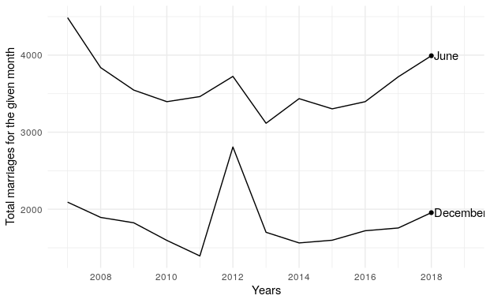

<!-- README.md is generated from README.Rmd. Please edit that file -->
statsDK
=======

The goal of statsDK is to make it easy to call the API of Statistics Denmark.

Installation
------------

You can install statsDK from github with:

``` r
# install.packages("devtools")
devtools::install_github("mikkelkrogsholm/statsDK")
```

Example
-------

This little vignette shows you how to get started with the `statsDK` package.

The retrievers
--------------

The package has a few "retriever"-functions that are used to retrieve data from Statistics Denmark. Those are: `retrieve_subjects()`, `retrieve_tables()`, `retrieve_metadata()` and the `retrieve_data()` functions.

### retrieve\_subjects

This function retrieves the overall subjects that are available in the API.

### retrieve\_tables

This function retrieves an overview of all the tables in the API. Lets use it to see what data we would like to fetch:

``` r
library(statsDK); library(tidyverse); library(stringr)

tables <- retrieve_tables()

glimpse(tables)
#> Observations: 1,884
#> Variables: 8
#> $ id           <chr> "FOLK1A", "FOLK1B", "FOLK1C", "FOLK1D", "FOLK1E",...
#> $ text         <chr> "Population at the first day of the quarter", "Po...
#> $ unit         <chr> "number", "number", "number", "number", "number",...
#> $ updated      <chr> "2017-08-14T09:00:00", "2017-08-14T09:00:00", "20...
#> $ firstPeriod  <chr> "2008Q1", "2008Q1", "2008Q1", "2008Q1", "2008Q1",...
#> $ latestPeriod <chr> "2017Q3", "2017Q3", "2017Q3", "2017Q3", "2017Q3",...
#> $ active       <lgl> TRUE, TRUE, TRUE, TRUE, TRUE, TRUE, TRUE, TRUE, T...
#> $ variables    <list> [<"region", "sex", "age", "marital status", "tim...
```

Lets say we are interested in marriages. Maybe there is an official data set about marriages that we can use?

First we unnest the variables column:

``` r
tables_long <- tables %>%
  unnest(variables)
```

Then we see if we can find something with marriage. We use the `str_detect()` function from the `stringr` package to detect a text pattern matching marriage:

``` r

marriage_tables <- tables_long %>%
  filter(str_detect(tables_long$variables, "marriage"))

glimpse(marriage_tables)
#> Observations: 10
#> Variables: 8
#> $ id           <chr> "VIEDAG", "VIEDAG", "VIE6", "VIE307", "VIE307", "...
#> $ text         <chr> "Marriages", "Marriages", "Marriages between two ...
#> $ unit         <chr> "number", "number", "number", "number", "number",...
#> $ updated      <chr> "2017-02-20T09:00:00", "2017-02-20T09:00:00", "20...
#> $ firstPeriod  <chr> "2007", "2007", "2012", "2006", "2006", "2006", "...
#> $ latestPeriod <chr> "2016", "2016", "2016", "2016", "2016", "2016", "...
#> $ active       <lgl> TRUE, TRUE, TRUE, TRUE, TRUE, TRUE, TRUE, TRUE, T...
#> $ variables    <chr> "day of marriage", "month of the marriage", "type...
```

Indeed there is. There is the `VIEDAG` table that seems to have data on marriage that we might be interested in. Lets therefore have a look at the meta data for that particular table.

### retrieve\_metadata

This function retrieves meta data for a table - like our `VIEDAG` table.

``` r
viedag_meta <- retrieve_metadata("VIEDAG")

glimpse(viedag_meta)
#> List of 9
#>  $ id           : chr "VIEDAG"
#>  $ text         : chr "Marriages"
#>  $ description  : chr "Marriages by day of marriage, month of the marriage and time"
#>  $ unit         : chr "number"
#>  $ updated      : chr "2017-02-20T09:00:00"
#>  $ contact      :List of 3
#>   ..$ name : chr "Connie Østberg"
#>   ..$ phone: chr "+4539173384"
#>   ..$ mail : chr "cbn@dst.dk"
#>  $ documentation:List of 2
#>   ..$ id : chr "fc512ffc-7334-4237-aab9-b776fcc6748c"
#>   ..$ url: chr "http://www.dst.dk/documentationofstatistics/fc512ffc-7334-4237-aab9-b776fcc6748c"
#>  $ footnote     : NULL
#>  $ variables    :'data.frame':   3 obs. of  5 variables:
#>   ..$ id         : chr [1:3] "VDAG" "VIMDR" "Tid"
#>   ..$ text       : chr [1:3] "day of marriage" "month of the marriage" "time"
#>   ..$ elimination: logi [1:3] TRUE TRUE FALSE
#>   ..$ time       : logi [1:3] FALSE FALSE TRUE
#>   ..$ values     :List of 3
#>   .. ..$ :'data.frame':  32 obs. of  2 variables:
#>   .. ..$ :'data.frame':  13 obs. of  2 variables:
#>   .. ..$ :'data.frame':  10 obs. of  2 variables:
```

The list of meta data has a lot of information that we can use to determine wether or not to use the data. There is an URL under documentation that we can follow to read a lot more about the data and how it is collected. There is contact information if we still have unanswered questions that need to be answered.

And there is also a part of the list called variables. This is the part we need to determine what we can get from calling that table directly and also how we should call it. We will use the helper function `get_variables()` to get a nice tidy tibble to inspect.

``` r
variables <- get_variables(viedag_meta)

glimpse(variables)
#> Observations: 55
#> Variables: 4
#> $ param       <chr> "VDAG", "VDAG", "VDAG", "VDAG", "VDAG", "VDAG", "V...
#> $ setting     <chr> "TOT", "D01", "D02", "D03", "D04", "D05", "D06", "...
#> $ description <chr> "Total", "1.", "2.", "3.", "4.", "5.", "6.", "7.",...
#> $ type        <chr> "day of marriage", "day of marriage", "day of marr...
```

Lets see if we can get a short overview of all the different options we have. Lets make a tibble for this vignette that shows the first, middle and last row of each parameter:

``` r
variable_overview <- variables %>% 
  group_by(param) %>%
  slice(c(1, round(n()/2), n())) %>%
  ungroup()

variable_overview
#> # A tibble: 9 x 4
#>   param setting description                  type
#>   <chr>   <chr>       <chr>                 <chr>
#> 1   Tid    2007        2007                  time
#> 2   Tid    2011        2011                  time
#> 3   Tid    2016        2016                  time
#> 4  VDAG     TOT       Total       day of marriage
#> 5  VDAG     D15         15.       day of marriage
#> 6  VDAG     D31         31.       day of marriage
#> 7 VIMDR     TOT       Total month of the marriage
#> 8 VIMDR     005         May month of the marriage
#> 9 VIMDR     012    December month of the marriage
```

From this overview it looks like `Tid` is the year, `VDAG` is the day of the month and `VIMDR` is the month. `VDAG` and `VIMDR` also has a `TOT` that is the total.

With this newfound knowledge we can now construct an API call to get the data we are interested in.

### retrieve\_data

This is the function that actually retrieves the data that we need.

Lets get the total data for each month of june and december for all the available years. This forces us to construct an API call that shows different aspects.

From the variable overview we did earlier we can see that in order to get the `Total` for days of marriage then we have to use the `TOT` setting for the `VDAG` parameter. And in order to get the month of `June` and `December` we will have to use the `006` and `012` setting for the `VIMDR` parameter. But how do we call all years? Easy, we just have to set that to be an asterix `*`.

Below is the call to the API:

``` r
VIEDAG <- retrieve_data("VIEDAG", Tid = "*", VDAG = "TOT", VIMDR = "006,012")
#> Retrieved Marriages by day of marriage, month of the marriage, Indhold and time
```

Let us have a glimpse at the data:

``` r
glimpse(VIEDAG)
#> Observations: 20
#> Variables: 5
#> $ `day of marriage`       <chr> "Total", "Total", "Total", "Total", "T...
#> $ `month of the marriage` <chr> "June", "June", "June", "June", "June"...
#> $ Indhold                 <chr> "Marriages", "Marriages", "Marriages",...
#> $ time                    <chr> "2007", "2008", "2009", "2010", "2011"...
#> $ value                   <int> 4486, 3838, 3546, 3396, 3462, 3724, 31...
```

Finally lets plot it and see what is going on in our new marriage data set:

``` r

VIEDAG$time <- as.numeric(VIEDAG$time)

ggplot(VIEDAG) +
  geom_line(aes(x = time, value, group = `month of the marriage`)) +
  annotate("text", x = 2016.1, y = c(3396, 1721), label = c("June", "December"),
           hjust = 0) +
  annotate("point", x = 2016, y = c(3396, 1721)) +
  xlim(2007, 2017) +
  labs(y = "Total marriages for the given month", x = "Years") +
  theme_minimal()
```



There is quite a spike in the data for December 2012. A lot of people got married in December in that particular year...

Can you figure out why? Make your own API call that calls all days in December for all years and see if you can figure out what made that particular year so different...

Further ressources
------------------

Visit the <http://statbank.dk/> and <http://api.statbank.dk/console> for further exploration of Statistics Denmark data.
